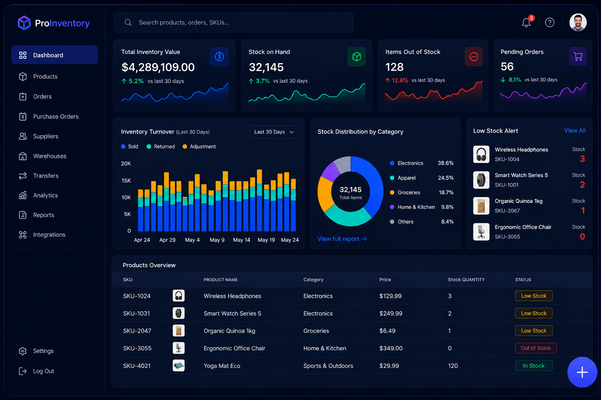
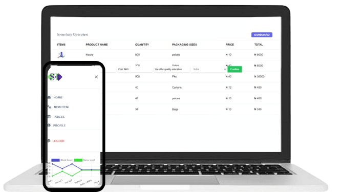

<div align="center">



<br />

<h1>
  
  &nbsp;ProInventory
</h1>

**Enterprise-grade inventory management — made simple, powerful, and smart.**

[](https://react.dev)
[](https://www.typescriptlang.org)
[](https://vitejs.dev)
[](https://firebase.google.com)
[](https://tailwindcss.com)
[](https://redux-toolkit.js.org)
[](./LICENSE)

<br />

[🚀 Live Demo](#) · [📖 Documentation](#features) · [🐛 Report Bug](https://github.com/rajiss-ctrl/inventory-mgt/issues) · [💡 Request Feature](https://github.com/rajiss-ctrl/inventory-mgt/issues)

</div>

---

## 📌 Overview

**ProInventory** is a full-stack, production-ready inventory management SaaS platform built with React, TypeScript, Vite, and Firebase. It provides real-time stock tracking, interactive analytics dashboards, multi-warehouse support, and a polished enterprise UI — all in one seamlessly integrated application.

> 🔄 **This is the v2 redesign.** An earlier version of this project (CRA + plain JSX, light-mode UI) was the foundation. This version is a **complete architectural and visual overhaul** — migrated from Create React App to Vite, converted from JavaScript to TypeScript, and rebuilt with a professional dark-mode design system from scratch. See [Version History](#-version-history) for details.

---

## ✨ Features

### 🏠 Landing Page
- Hero section with animated dashboard preview, trust badges and dual CTAs
- Trusted-by logos strip
- 6-card feature showcase grid
- Device preview section with statistics
- 3-tier pricing cards (Starter · Professional · Enterprise)
- 2-column FAQ accordion
- Full-width multi-column footer with newsletter signup

### 🔐 Authentication
- Email / password sign-in and registration
- Google OAuth (one-click sign-in)
- Guest demo login — explore the full dashboard without an account
- Password strength meter on registration
- Remember me (persists session to `localStorage`)
- Forgot password / email reset flow
- Protected routes with Firebase auth state guard

### 📊 Dashboard
- **4 KPI stat cards** — Total Inventory Value, Stock on Hand, Items Out of Stock, Pending Orders — each with a mini sparkline
- **Inventory Turnover bar chart** — stacked Sold / Returned / Adjustment over 30 days
- **Stock Distribution donut chart** — breakdown by category with live percentages
- **Low Stock Alert panel** — products below threshold, colour-coded severity
- **Recent Activity feed** — latest stock changes and order events
- **Products Overview table** — SKU, name, category, price, quantity, status badges, edit/delete actions, pagination
- Real-time Firestore listeners — data updates instantly across all open tabs

### 📦 Product Management
- Full **Add Product** page (not a modal — inline dashboard view)
- Drag-and-drop image upload with compression and Cloudinary unsigned uploads
- Category, currency, pricing, packaging size, description
- Edit product inline with stock state editor
- Delete confirmation flow

### 🎨 Design System
- Dark-mode-first UI with a 70+ token CSS custom property system (`--color-brand-*`, `--color-bg-*`, `--color-surface-*`, `--color-stock-*`, etc.)
- Consistent `Inter` typeface
- Glassmorphism cards, radial glows, dot-grid backgrounds
- Fully responsive — mobile → tablet → desktop

### 📄 Additional Pages
- **404 Not Found** — custom illustrated page with `404-bg.png` / `404-bubble.png`, helpful links grid
- **Business Profile** — create and manage your business brand within the app
- **Reset Password** — email-based reset flow

---

## 🗂 Project Structure

```
src/
├── app/
│   ├── ProtectedRoute.tsx     # Auth guard — redirects unauthenticated users
│   ├── router.tsx             # All lazy-loaded routes in one place
│   └── store.ts               # Redux store (auth · stock · business · modal)
│
├── assets/
│   ├── img/                   # All images and illustrations
│   └── *.json                 # Lottie animation data
│
├── components/
│   ├── dashboard/             # StockTable, StockChart, DashboardSidebar,
│   │                          # DashboardHeader, DashboardWidgets, AddProductView,
│   │                          # StockStateEditor, AddStockModal, StockAlertBanner…
│   ├── forms/                 # AuthInput, StockInputField
│   ├── layout/                # RootLayout, Navbar, Footer, FooterSimple,
│   │                          # AuthLeftPanel
│   └── ui/                    # LoadingSpinner, Button (shadcn)
│
├── features/
│   ├── auth/authSlice.ts      # setCurrentUser · clearCurrentUser · fetchUsers
│   ├── business/businessSlice.ts
│   ├── stock/stockSlice.ts    # setStockData
│   └── ui/modalSlice.ts
│
├── hooks/
│   ├── useAppDispatch.ts      # Pre-typed dispatch hook
│   └── useAppSelector.ts      # Pre-typed selector hook
│
├── pages/
│   ├── sections/              # HeroSection · FeatureShowcase · DevicePreview
│   │                          # PricingSection · FaqSection
│   ├── BusinessProfilePage.tsx
│   ├── DashboardPage.tsx
│   ├── HomePage.tsx
│   ├── LoginPage.tsx
│   ├── NotFoundPage.tsx
│   ├── RegisterPage.tsx
│   └── ResetPasswordPage.tsx
│
├── services/
│   └── firebase.ts            # Firebase init · auth · db · storage · useAuth hook
│
├── types/
│   └── index.ts               # Product · BusinessProfile · CurrentUser + all Redux state types
│
├── App.tsx                    # Real-time Firestore listeners only
├── main.tsx                   # BrowserRouter · Redux Provider · StrictMode
└── index.css                  # Tailwind v4 + full brand token system
```

---

## 🛠 Tech Stack

| Layer | Technology | Version |
|---|---|---|
| **Framework** | React | 18.3 |
| **Language** | TypeScript | 5.7 |
| **Build Tool** | Vite | 6.2 |
| **Styling** | Tailwind CSS v4 | 4.1 |
| **State Management** | Redux Toolkit | 2.5 |
| **React-Redux** | react-redux | 9.2 |
| **Routing** | React Router DOM | 7.1 |
| **Backend / Auth** | Firebase (Auth + Firestore + Storage) | 11.2 |
| **Forms** | React Hook Form + Yup | 7.5 / 1.6 |
| **Charts** | Chart.js + react-chartjs-2 | 4.4 / 5.3 |
| **Icons** | React Icons | 5.4 |
| **Animations** | Lottie React | 2.4 |
| **Print** | react-to-print | 3.0 |
| **Image Compression** | browser-image-compression | 2.0 |
| **UI Primitives** | Radix UI · shadcn/ui | latest |
| **Linting** | ESLint + typescript-eslint | 9.x / 8.x |

---

## 🚀 Getting Started

### Prerequisites

- Node.js ≥ 18
- npm ≥ 9
- A Firebase project with **Authentication**, **Firestore**, and **Storage** enabled

### 1 — Clone the repository

```bash
git clone https://github.com/rajiss-ctrl/inventory-mgt.git
cd inventory-mgt
```

### 2 — Install dependencies

```bash
npm install
```

### 3 — Configure environment variables

Create a `.env` file in the project root:

```env
VITE_FIREBASE_KEY=your_api_key
VITE_FIREBASE_AUTH_DOMAIN=your_project.firebaseapp.com
VITE_FIREBASE_PROJECT_ID=your_project_id
VITE_FIREBASE_STORAGE_BUCKET=your_project.appspot.com
VITE_FIREBASE_MESSAGING_SENDER_ID=your_sender_id
VITE_FIREBASE_APP_ID=your_app_id

VITE_CLOUDINARY_CLOUD_NAME=your_cloud_name
VITE_CLOUDINARY_UPLOAD_PRESET=your_unsigned_upload_preset
```

> ⚠️ Never commit your `.env` file. It is already listed in `.gitignore`.

### 4 — Start the development server

```bash
npm run dev
```

Open [http://localhost:5173](http://localhost:5173) in your browser.

### 5 — Build for production

```bash
npm run build
```

Preview the production build locally:

```bash
npm run preview
```

---

## 🔥 Firebase Setup

1. Go to the [Firebase Console](https://console.firebase.google.com) and create a new project
2. Enable **Email/Password** and **Google** providers under **Authentication → Sign-in method**
3. Create a **Firestore Database** in production mode
4. Enable **Firebase Storage** only if you still use Firebase for other assets; the app’s product and logo uploads now use Cloudinary
5. Add the following Firestore security rules:

```javascript
rules_version = '2';
service cloud.firestore {
  match /databases/{database}/documents {
    match /stock/{docId} {
      allow read, write: if request.auth != null
        && request.auth.uid == resource.data.user_id;
      allow create: if request.auth != null;
    }
    match /businesses/{docId} {
      allow read, write: if request.auth != null
        && request.auth.uid == resource.data.user_id;
      allow create: if request.auth != null;
    }
    match /users/{docId} {
      allow read, write: if request.auth != null;
    }
  }
}
```

## ☁️ Cloudinary Setup for Product and Logo Uploads

Use Cloudinary for all product images and subscriber/business logo uploads so the browser does not depend on Firebase Storage CORS behavior during local development.

1. Create a Cloudinary account and open the **Dashboard**.
2. Copy your Cloudinary **cloud name** from the dashboard.
3. Go to **Settings → Upload → Upload presets** and create an **unsigned** preset.
4. In the project root, create a `.env` file with:

```env
VITE_CLOUDINARY_CLOUD_NAME=your_cloud_name
VITE_CLOUDINARY_UPLOAD_PRESET=your_unsigned_upload_preset
```

5. Keep the same folder naming convention used by the app:
   - `products` for item images
   - `businesses` for subscriber/company logos
6. The upload flow already calls the shared helper in [src/services/cloudinary.service.ts](src/services/cloudinary.service.ts), so the product form and business profile form will send the file to Cloudinary, receive a secure URL, and store that URL in Firestore.

---

## 🔄 Version History

### v2.0 — Current (ProInventory Redesign)
> **Complete rewrite and visual overhaul**

- **Migrated** from Create React App → **Vite 6** (10× faster builds, instant HMR)
- **Converted** entire codebase from JavaScript/JSX → **TypeScript** with strict typing, interfaces, and typed Redux slices
- **Rebuilt UI** from a light-mode basic layout → professional **dark-mode design system** with 70+ CSS custom property tokens
- **Restructured** flat file organization → industry-standard `app/ · components/ · features/ · hooks/ · pages/ · services/ · types/` architecture
- **Upgraded** Redux + react-redux from v1.9/v8 → **RTK v2 + react-redux v9**
- **Replaced** single combined `SigninSignup.jsx` → separate **`LoginPage`** and **`RegisterPage`** with full validation, password strength meter, Google OAuth, and guest login
- **Added** full landing page with Hero, Features, Pricing, FAQ, Footer
- **Added** `AddProductView` as a full dashboard inline page instead of a modal
- **Added** real-time Firestore listeners in `App.tsx` keeping all views in sync
- **Added** typed `useAppDispatch` / `useAppSelector` hooks
- **Added** custom 404 page with illustrated assets

### v1.0 — Legacy (StockTrack CRA)
> Original version — available on the [`legacy` branch](https://github.com/rajiss-ctrl/inventory-mgt/tree/legacy)

- Built with **Create React App** + plain **JavaScript/JSX**
- Light-mode UI with basic Tailwind utility classes
- Simple Redux store with untyped slices
- Combined sign-in / sign-up component
- Modal-based add stock form
- No landing page

---

## 📸 Screenshots

| Page | Preview |
|---|---|
| **Landing — Hero** |  |
| **Dashboard** |  |
| **Add Product** | _See live demo_ |
| **Login** | _See live demo_ |
| **Register** | _See live demo_ |

---

## 🤝 Contributing

Contributions, issues and feature requests are welcome.

1. Fork the project
2. Create your feature branch: `git checkout -b feat/amazing-feature`
3. Commit your changes: `git commit -m "feat: add amazing feature"`
4. Push to the branch: `git push origin feat/amazing-feature`
5. Open a Pull Request

Please follow the existing code style and TypeScript conventions.

---

## 📄 License

Distributed under the **MIT License**. See [`LICENSE`](./LICENSE) for more information.

---

## 👤 Author

<div align="center">

**RajisSaraF.Dev**

[](https://github.com/rajiss-ctrl)
[](https://twitter.com/rajisanjo)

_Built with 💜 — Inventory management made simple, powerful, and smart._

</div>
